# TDSE Framework Extension: concurrencia, apagado gradual y despliegue

Extensión de mi propio framework web en Java (sin Spring), tomado del repositorio [TDSE_JavaFramework](https://github.com/marianamalagon11/TDSE_JavaFramework). El objetivo de este repositorio es que el framework soporte manejo concurrente de peticiones, apagado gradual, puerto configurable por variable de entorno, ejecución en Docker y despliegue en EC2.

> Este README se va completando a medida que avanza el trabajo. Las secciones de Docker y de la nube se agregan cuando esos pasos estén verificados.

## Estado del avance

| Requisito | Estado |
|---|---|
| Framework base importado | Hecho |
| Manejo concurrente de peticiones | Hecho (threads virtuales de Java 21) |
| Apagado gradual | Hecho (cierra el socket de inmediato y espera las peticiones en curso) |
| Puerto por variable de entorno | Ya existía en el framework base (`PORT`) |
| Ejecución en Docker | Hecho: imagen construida, concurrencia y apagado gradual verificados en el contenedor |
| Despliegue en EC2 | Pendiente |

## Estado actual del framework

El framework base es un servidor HTTP escrito en Java sin librerías externas. El desarrollador registra servicios GET con lambdas y no toca el ciclo de conexión.

- Sirve archivos estáticos desde `src/main/resources/webroot`.
- Registra servicios GET con lambdas: `get("/hello", (req, resp) -> ...)`.
- Extrae valores del query string con `req.getValue("name")`.
- Resuelve cada petición en este orden: ruta dinámica, archivo estático, 404.
- Responde 400, 404 o 500 ante errores sin caerse.
- Lee `PORT`, `APP_ENV` y `GREETING_PREFIX` desde variables de entorno.
- Solo soporta el método GET.

### Arquitectura

```
Application                      registra rutas y configuración
    |
WebFramework                     API pública: get(), staticfiles(), start(), stop()
    |
    +--> Router                  guarda la tabla ruta -> lambda
    |
HttpServer2                      acepta conexiones, interpreta la petición, envía la respuesta
    |
    +--> Request / Response      datos HTTP que ve la lambda
    |
    +--> StaticFileService       entrega archivos cuando no hay ruta dinámica
```

### Variables de entorno

| Variable | Propósito | Valor por defecto |
|---|---|---|
| `PORT` | Puerto en el que escucha el servidor | `8080` |
| `GREETING_PREFIX` | Texto con el que empieza la respuesta de `/hello` | `Hello` |
| `APP_ENV` | Ambiente. La ruta `/shutdown` solo existe si vale `development` | `development` |

## Cambios de esta extensión

El único archivo de código modificado es [HttpServer2.java](src/main/java/co/edu/escuelaing/httpserver/httpserver2/HttpServer2.java).

### Antes: servidor secuencial

El mismo hilo aceptaba la conexión y la procesaba completa antes de aceptar la siguiente. Una conexión lenta, o un cliente que no enviaba nada, bloqueaba a todos los demás hasta 5 segundos (el timeout de lectura).

```java
while (running) {
    try (Socket clientSocket = serverSocket.accept()) {
        clientSocket.setSoTimeout(5000);
        handleRequest(clientSocket);
    }
}
```

### Ahora: un thread virtual por conexión

El ciclo principal solo acepta conexiones y las despacha a un `ExecutorService` de threads virtuales (Java 21). Cada petición se procesa en paralelo y el ciclo vuelve de inmediato a `accept()`.

```java
requestExecutor = Executors.newVirtualThreadPerTaskExecutor();

while (running) {
    Socket clientSocket = socket.accept();
    requestExecutor.execute(() -> attendConnection(clientSocket));
}
```

### Apagado gradual

`stop()` ahora hace dos cosas:

1. Pone `running = false` (la variable es `volatile`, porque `stop()` corre en el thread virtual de `/shutdown` y el ciclo principal la lee desde otro thread).
2. Cierra el `ServerSocket` de inmediato. Así el `accept()` bloqueado lanza una excepción y el ciclo termina sin esperar a una conexión nueva.

Al salir del ciclo, `start()` llama a `requestExecutor.shutdown()` (no acepta tareas nuevas, pero no corta las que están corriendo) y luego a `awaitTermination(30, SECONDS)`. Solo después imprime "Servidor detenido.". Así ninguna petición queda a medias, incluida la de `/shutdown`, que alcanza a enviar su respuesta completa.

## Cómo compilar y ejecutar

Requisitos: Java 21 y Maven 3.9 o superior.

Compilar, correr las pruebas y empaquetar:

```bash
mvn clean package
```

Ejecutar el JAR generado:

```bash
PORT=8085 java -jar target/httpServer2-1.0-SNAPSHOT.jar
```

En PowerShell:

```powershell
$env:PORT="8085"; java -jar target/httpServer2-1.0-SNAPSHOT.jar
```

Luego abrir `http://localhost:8085`.

## Cómo ejecutar en Docker

El [Dockerfile](Dockerfile) tiene dos etapas. La primera usa `maven:3.9-eclipse-temurin-21` para compilar y generar el jar. La segunda usa `eclipse-temurin:21-jre` y copia solo ese jar, así la imagen final queda liviana. Por defecto la imagen trae `APP_ENV=production`, así que `/shutdown` no existe.

Construir la imagen:

```bash
docker build -t webframework-ext .
```

Ejecutar en modo producción (sin `/shutdown`):

```bash
docker run -d --name webframework -p 8080:8080 -e PORT=8080 webframework-ext
```

Ejecutar en modo desarrollo, para poder probar el apagado por HTTP:

```bash
docker run -d --name webframework -p 8080:8080 -e PORT=8080 -e APP_ENV=development webframework-ext
```

El primer `8080` de `-p` es el puerto de la máquina y el segundo el del contenedor, que debe coincidir con `PORT`. Para detener y borrar el contenedor: `docker rm -f webframework`.

## Evidencia de progreso

### Commit de la extensión

La concurrencia y el apagado gradual se implementaron en el commit [`e2a9ac7`](https://github.com/marianamalagon11/TDSE_JavaFramework-Extension/commit/e2a9ac7), "Implement concurrent request handling and graceful shutdown".

### Pruebas automatizadas

Las 23 pruebas JUnit del framework pasan con el servidor concurrente (0 fallos). La clase `ServidorTest`, que levanta el servidor real y le pega por HTTP, pasó de tardar unos 6 segundos con el servidor secuencial a 0.87 segundos. La causa es la prueba `clienteCalladoNoBloqueaParaSiempre`: un cliente se conecta y no envía nada, y antes eso bloqueaba la siguiente petición hasta el timeout de 5 segundos. Ahora esa conexión espera en su propio thread virtual y la petición siguiente se responde de inmediato.

### Compilación con Maven

`mvn clean package` termina con `BUILD SUCCESS` y genera el JAR ejecutable con la extensión aplicada:

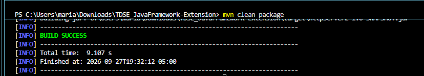

### Verificación local de la concurrencia

Con el servidor corriendo con `java -jar` en el puerto 8085.

**Prueba A: una conexión lenta no bloquea a las demás.** Se abre una conexión TCP que no envía nada (el servidor la mantiene hasta el timeout de 5 segundos) y se mide cuánto tarda `/pi`. Con el servidor secuencial tenía que esperar ese timeout. Ahora responde en 97 ms:

```powershell
$c = New-Object System.Net.Sockets.TcpClient("localhost", 8085)
Measure-Command { curl.exe -s http://localhost:8085/pi }
```

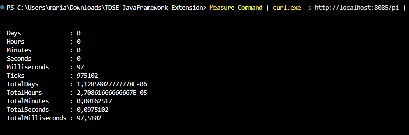

**Prueba B: 50 peticiones simultáneas.** curl genera 50 URLs con `[1-50]` y las envía en paralelo, hasta 20 a la vez:

```powershell
curl.exe -s --parallel --parallel-max 20 "http://localhost:8085/pi?n=[1-50]" -o NUL
```

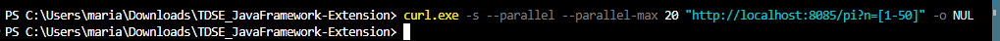

En el registro del servidor las peticiones no aparecen en orden (por ejemplo `n=3` y `n=4` después de `n=21`, o `n=46` antes de `n=45`), porque cada una se atiende en su propio thread virtual y termina cuando le toca:

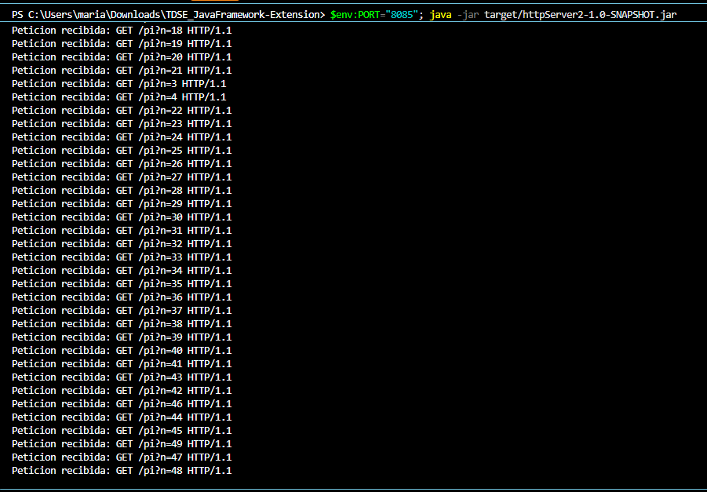

**Prueba C: apagado gradual.** Se abre otra conexión callada y luego se pide `/shutdown`. La respuesta llega completa, pero el servidor no sale de inmediato:

```powershell
$c = New-Object System.Net.Sockets.TcpClient("localhost", 8085)
curl.exe -s http://localhost:8085/shutdown
```

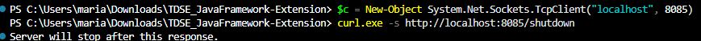

En el registro se ve que primero termina la conexión callada (`Read timed out`, al cumplirse su timeout de 5 segundos) y solo después aparece `Servidor detenido.`. Es decir, el servidor esperó a la petición en curso antes de salir:

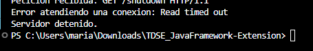

### Verificación en Docker

**Imagen construida.** El `docker build` compila el proyecto con Maven dentro de la imagen (60 s la primera vez) y copia el jar a la imagen final:

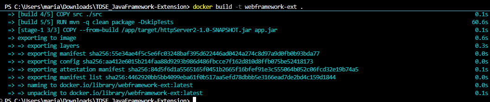

**Contenedor en ejecución.** Se levanta con `PORT=8080` y `APP_ENV=development`:

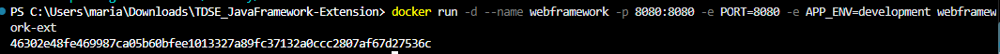

`docker ps` muestra el contenedor `webframework` con el puerto 8080 publicado, y `docker logs` confirma que el servidor lee `APP_ENV` y escucha en el puerto 8080. La lista incluye además contenedores del repositorio 1 que estaban corriendo en la misma máquina:

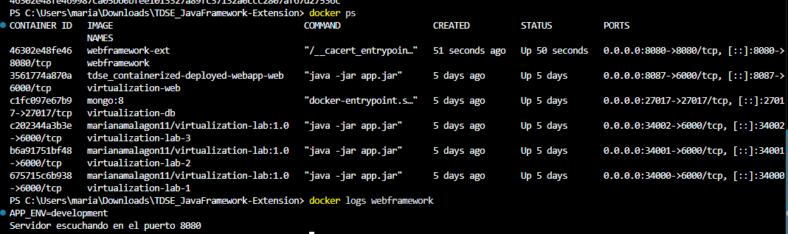

El mismo contenedor visto en Docker Desktop:


**Prueba A en el contenedor.** Con una conexión callada abierta, `/pi` responde en 107 ms:

```powershell
$c = New-Object System.Net.Sockets.TcpClient("localhost", 8080)
Measure-Command { curl.exe -s http://localhost:8080/pi }
```

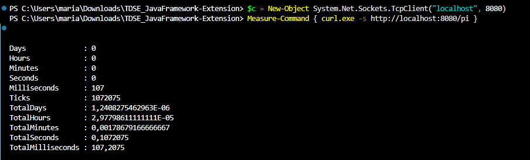

**Prueba B en el contenedor.** 50 peticiones simultáneas contra el puerto 8080. En el registro del contenedor vuelven a aparecer fuera de orden (por ejemplo `n=3` y `n=4` después de `n=21`), señal de que se atienden en paralelo:

```powershell
curl.exe -s --parallel --parallel-max 20 "http://localhost:8080/pi?n=[1-50]" -o NUL
docker logs webframework
```

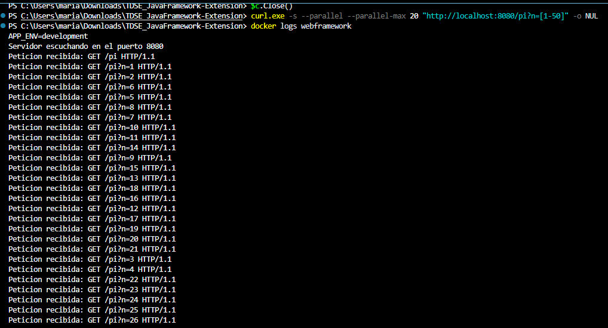

**Prueba C en el contenedor: apagado gradual.** Con otra conexión callada abierta, se pide `/shutdown`. La respuesta llega completa:

```powershell
$c = New-Object System.Net.Sockets.TcpClient("localhost", 8080)
curl.exe -s http://localhost:8080/shutdown
```

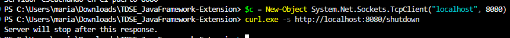

Pasados unos segundos, el registro muestra `GET /shutdown`, `Servidor detenido.` y `Read timed out`, y `docker ps -a` muestra el contenedor como `Exited (0)`, es decir, terminó sin error. Que aparezca `Read timed out` prueba que el proceso esperó a la conexión en curso: si hubiera salido de inmediato, la JVM habría terminado antes de que esa conexión cumpliera su timeout de 5 segundos y ese mensaje nunca se habría escrito. (`docker logs` junta la salida normal y la de errores, y no garantiza el orden entre ambas.)

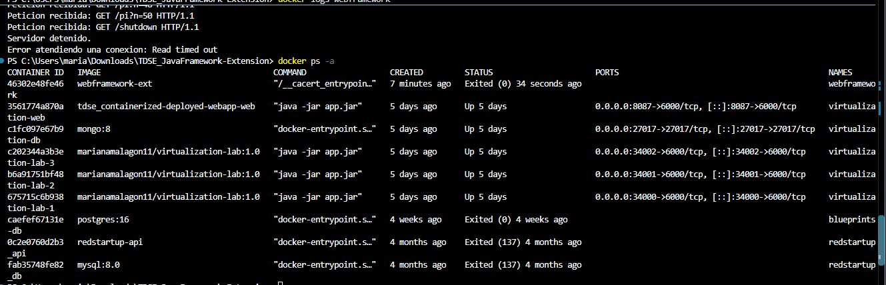
